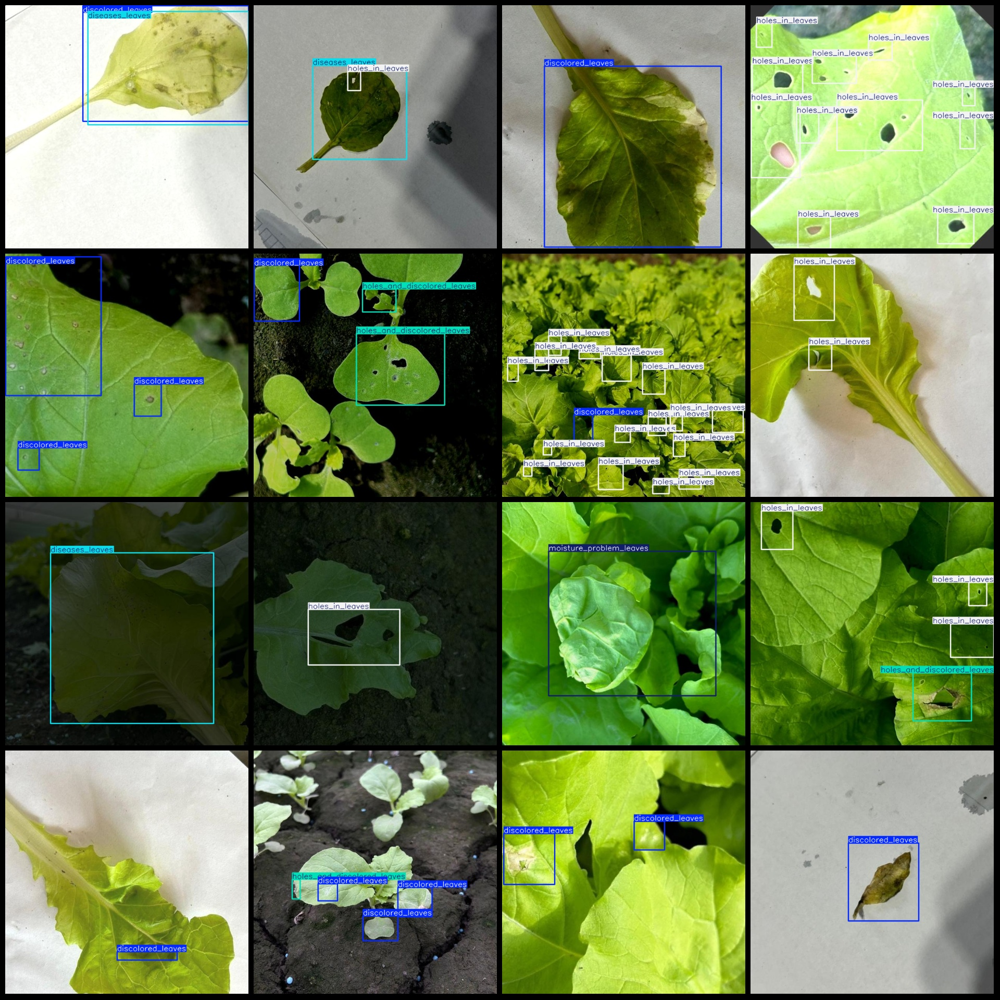
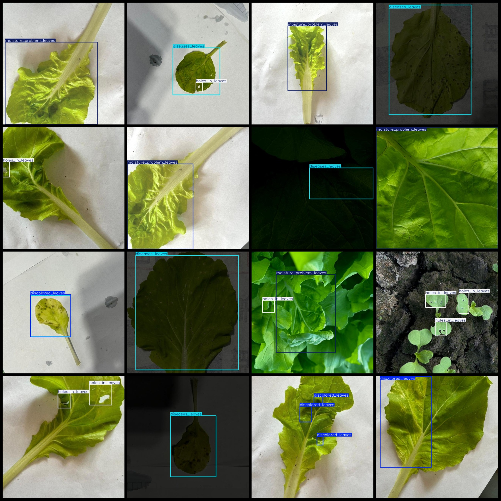

# Bok Choy Leaf Health Status and Disease Detection Dataset VOC+YOLO Format with 2148 Images in 7 Categories

Please note that approximately one-third of the images in the dataset are original, while the remaining are enhanced.

The dataset format is Pascal VOC format combined with YOLO format (without a separate split path for the txt files, just containing JPG images along with VOC format XML files and YOLO format txt 
files).

There are 2148 jpg files in total, 2148 xml files, and 2148 txt files.

The number of annotations per category is:
- discolored_leaves : 1946
- diseases_leaves : 324
- healthy_leaves : 3
- holes_and_discolored_leaves : 668
- holes_in_leaves : 2586
- insects : 121
- moisture_problem_leaves : 302

The total number of boxes per category is: 5950

The number of images per category is:
- discolored_leaves : 1094
- diseases_leaves : 317
- healthy_leaves : 3
- holes_and_discolored_leaves : 467
- holes_in_leaves : 818
- insects : 36
- moisture_problem_leaves : 260

Image resolution: 640x640

Annotation tool used: labelImg
Annotation rules: draw a box around each category

Important notes: The dataset does not have been divided into training, validation, or test sets; users need to manually divide them.

Special notice: This dataset does not guarantee any accuracy on trained models or weight files.

Image preview:
## Images

Here is a pay link on Stripe ( https://buy.stripe.com/3cs8yP7sY87d0vu9AB ). Please contact me lonlonago@foxmail.com after funding $89, and I will send you a complete data files , thank you!

